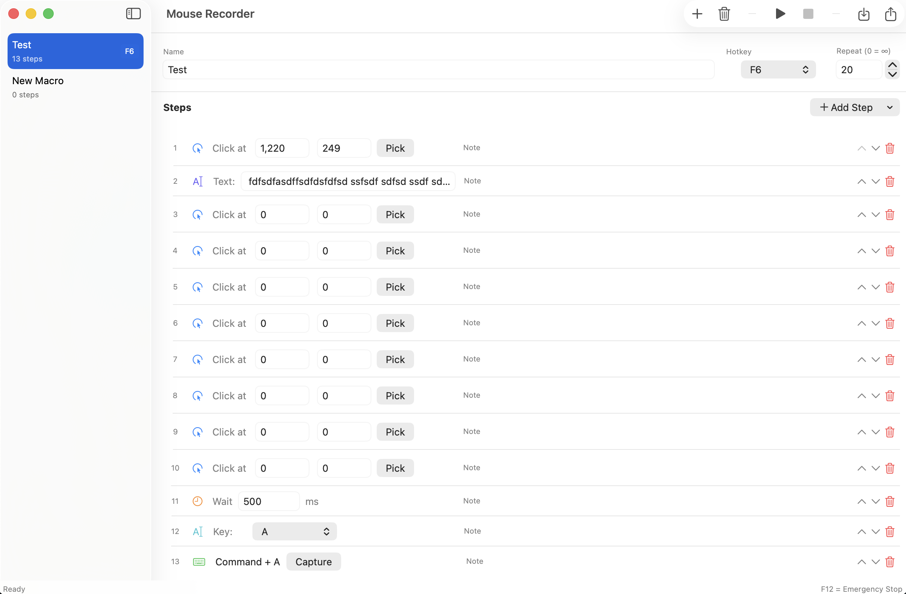

# Mouse Recorder for macOS

A native macOS app for recording and playing back mouse and keyboard macros. Create automation sequences with clicks, keystrokes, text input, and timed delays — then trigger them instantly with global hotkeys.


## Features

- **7 step types**: Left Click, Double Click, Right Click, Keyboard Shortcut, Keystroke, Type Text, Wait
- **Global hotkeys**: Assign F1–F11, Ctrl+F1–F12, or Ctrl+1–9 to trigger any macro
- **F12 emergency stop**: Instantly halt any running macro
- **Position picker**: Fullscreen crosshair overlay to capture screen coordinates
- **Key capture**: Record keyboard shortcuts with a visual dialog
- **Active step highlight**: See which step is executing in real-time
- **Import/Export**: Share macros as JSON files (compatible with [Windows version](https://github.com/amornj/mouse-recorder))
- **Menu bar**: Runs in the background with a status bar icon
- **Auto-save**: Macros persist automatically between sessions

## Screenshot



## Requirements

- macOS 13.0 (Ventura) or later
- **Accessibility permission** required for mouse/keyboard simulation

## Installation

### From Source

1. Clone the repository:
   ```bash
   git clone https://github.com/amornj/mouse-recorder-macOS.git
   cd mouse-recorder-macOS/MouseRecorder
   ```

2. Open in Xcode:
   ```bash
   open MouseRecorder.xcodeproj
   ```

3. Build and run (Cmd+R)

4. Grant Accessibility permission when prompted:
   - System Settings > Privacy & Security > Accessibility
   - Toggle on Mouse Recorder

### Command Line

```bash
cd MouseRecorder
swift build
swift run
```

## Usage

### Creating a Macro

1. Click **+** in the toolbar to create a new macro
2. Give it a name and assign a hotkey
3. Add steps using the **Add Step** menu:
   - **Mouse**: Left Click, Double Click, Right Click — use **Pick** to select coordinates
   - **Keyboard**: Keyboard Shortcut (combos like Ctrl+C), Keystroke (single key), Type Text (string input)
   - **Timing**: Wait (delay in milliseconds)
4. Set repeat count (0 = infinite loop)

### Running a Macro

- Press the assigned hotkey, or click **Play** in the toolbar
- Press **F12** at any time to stop immediately
- The active step highlights during playback

### Import/Export

- **Export**: File menu > Export All Macros, or right-click a macro > Export
- **Import**: File menu > Import Macros
- JSON format is compatible with the Windows version

## Keyboard Shortcuts

| Shortcut | Action |
|----------|--------|
| Cmd+N | New Macro |
| Cmd+I | Import Macros |
| Cmd+E | Export Macros |
| Delete | Delete Selected Macro |
| F12 | Emergency Stop (global) |

## Data Storage

Macros are saved to:
```
~/Library/Application Support/MouseRecorder/macros.json
```

## Cross-Platform Compatibility

Macros use the same JSON format as the [Windows version](https://github.com/amornj/mouse-recorder), enabling cross-platform sharing. The macOS-only step types (DoubleClick, RightClick, Keystroke, TypeText) are ignored by the Windows version.

## Privacy

Mouse Recorder requires Accessibility permission solely to simulate mouse clicks and keyboard input. No data is collected or transmitted. See the [Privacy Policy](docs/privacy-policy.md).

## Support

Having issues? See [Support](docs/support.md).

## License

MIT
